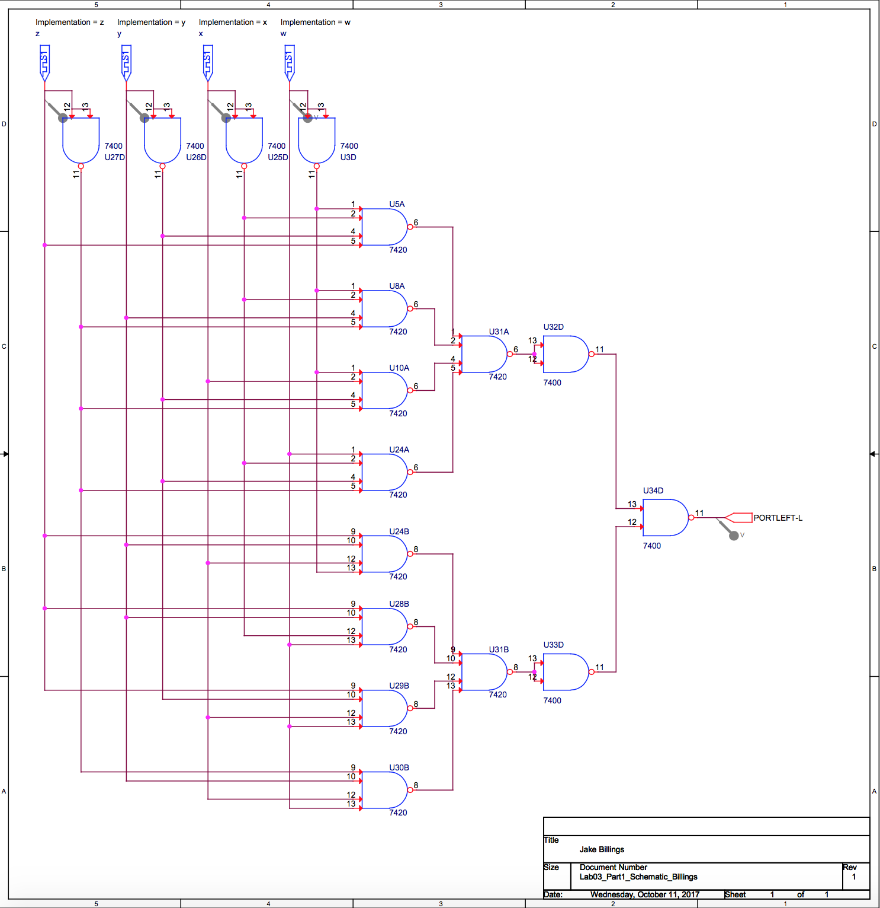

# edu-csci1510 #

This repository contains my work for the class CSCI1510 at University of Colorado Denver. The course covered the design of logical circuits with an emphasis on preparation for learning assembly. This repository contains all labs completed in ORCad.

### Other Projects ###
Checkout my other projects at [https://jakebillings.com](https://jakebillings.com) or contact me via [LinkedIn](https://www.linkedin.com/in/jake-billings/).
